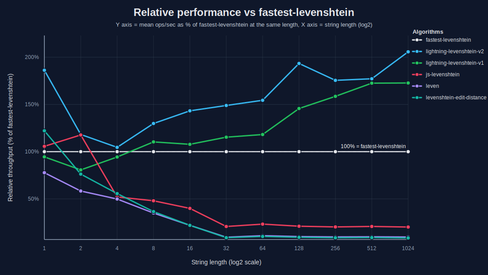
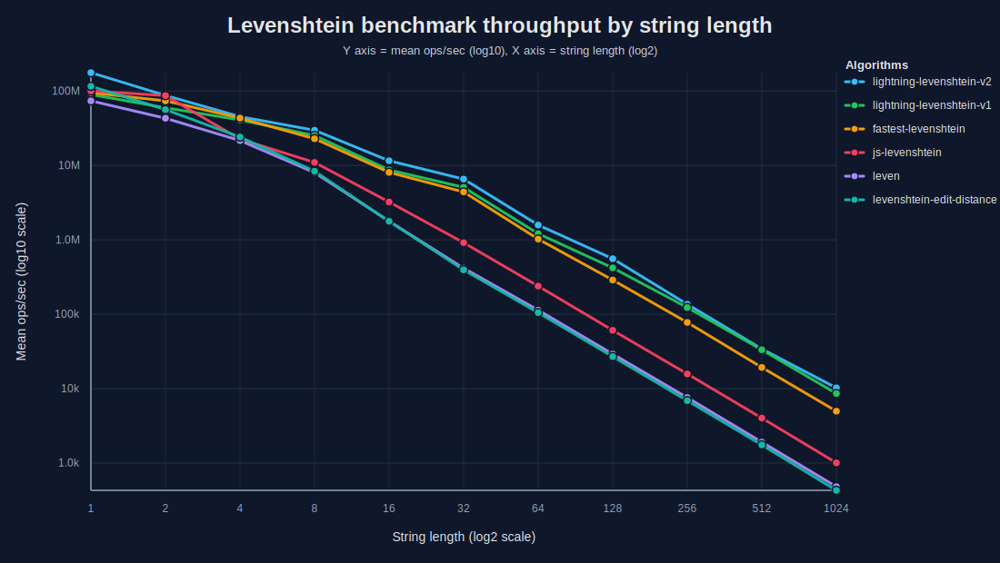
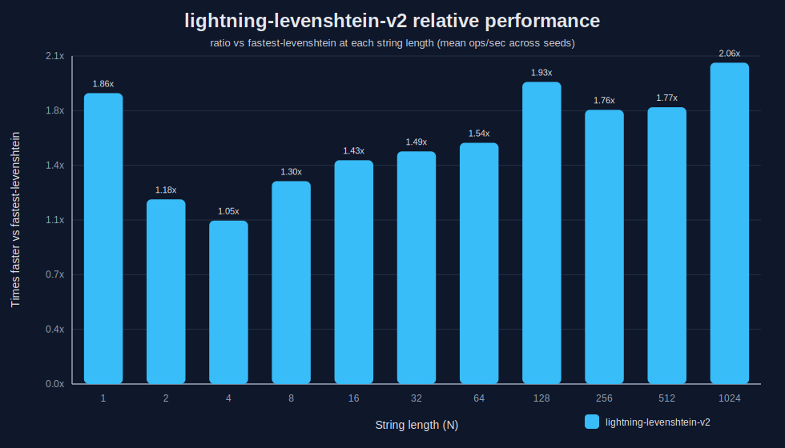
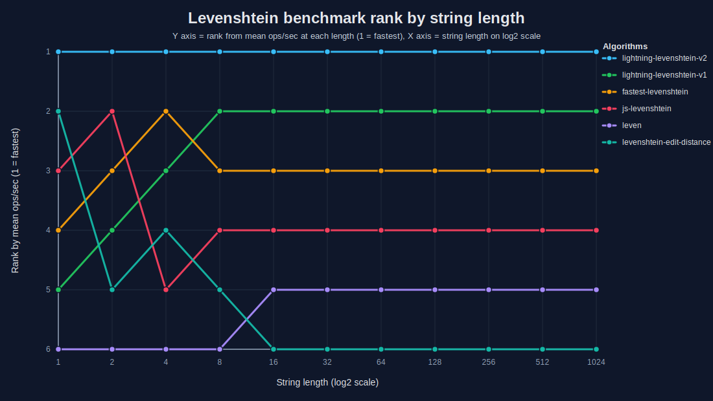

# ⚡ lightning-levenshtein

[](https://www.npmjs.com/package/lightning-levenshtein)
[](https://www.npmjs.com/package/lightning-levenshtein)
[](https://bundlephobia.com/package/lightning-levenshtein)
[](https://github.com/iWhatty/lightning-levenshtein/blob/main/LICENSE)
[](https://github.com/iWhatty/lightning-levenshtein)
[](https://www.npmjs.com/package/lightning-levenshtein)

Fast Levenshtein distance in pure JavaScript. Compact default API for general-purpose edit distance, plus opt-in subpaths for maximum throughput and Unicode-width character tables.

## Features

- Specialized kernels for very short strings
- Precompiled bit-parallel dispatch for short inputs
- Fixed-width Myers variants for medium inputs
- Generalized Myers fallback for large inputs
- Zero runtime dependencies
- Works in Node.js and browsers

---

## Install

```sh
pnpm add lightning-levenshtein
```

---

## Quick start

```js
import { distance, distanceMax, closest } from "lightning-levenshtein";

distance("kitten", "sitting");                 // 3
distanceMax("kitten", "sitting", 2) > 2;       // true (over threshold)
closest("kitten", ["kitchen", "sitting"]);     // "kitchen"
```

---

## API

The package exposes three logical entrypoints, each with an ESM-source path for bundlers and a pre-built minified path for unbundled `<script type="module">` use:

```jsonc
{
  "exports": {
    ".":             { "import": "./src/index.js",       "default": "./dist/lightning-levenshtein.min.js" },
    "./min":         {                                    "default": "./dist/lightning-levenshtein.min.js" },
    "./v2":          { "import": "./src/v2/index.js",    "default": "./dist/lightning-levenshtein-v2.min.js" },
    "./v2/min":      {                                    "default": "./dist/lightning-levenshtein-v2.min.js" },
    "./unicode":     { "import": "./src/unicode.js",     "default": "./dist/lightning-levenshtein-unicode.min.js" },
    "./unicode/min": {                                    "default": "./dist/lightning-levenshtein-unicode.min.js" }
  }
}
```

The `.`, `./v2`, and `./unicode` entrypoints route bundlers at ESM source so unused code can be tree-shaken. Explicit `/min` subpaths expose the pre-built Closure bundles for consumers that want them directly.

### Default API

```js
import { distance, distanceMax, closest } from "lightning-levenshtein";
```

The stable core API. Bundlers receive ESM source; unbundled consumers can use `lightning-levenshtein/min` to point at the pre-built bundle directly.

`distanceMax(a, b, maxDistance)` returns the exact distance when it is within the effective threshold. When the threshold is exceeded, it returns a value greater than the threshold rather than a sentinel such as `-1`. A fractional threshold between `0` and `1` is interpreted relative to the original length of `a` and rounded up.

`closest(str, candidates, maxDistance)` returns the first best candidate within the threshold. Candidate order breaks equal-distance ties.

### Max-throughput API

The `/v2` subpath exposes the larger max-throughput runtime:

```js
import { levenshteinLightning } from "lightning-levenshtein/v2";
```

Bundlers receive `src/v2/index.js`; `lightning-levenshtein/v2/min` exposes the pre-built bundle. The v2 runtime uses more aggressive length-based dispatch, tiny-string fast paths, precompiled 32-bit kernels, fixed-width Myers variants, and a generalized large-input fallback. Choose it when throughput matters more than the extra JavaScript payload.

### Unicode API

Full-width UTF-16 code-unit distance:

```js
import { distanceUnicode } from "lightning-levenshtein/unicode";
```

Use this path when your strings can contain code units above `255`, such as many BMP characters. It is intentionally separate from the default entrypoint so the default `distance` hot path does not pay for wider PEQ tables or per-call character-set routing. Use `lightning-levenshtein/unicode/min` for the pre-built bundle.

---

## Notes

### Which one should I pick?

Use the default package entrypoint if you want the stable general-purpose API with the smallest production build:

```js
import { distance, distanceMax, closest } from "lightning-levenshtein";
```

Use the `v2` subpath if you specifically want the specialized `levenshteinLightning` runtime and are comfortable with the larger payload:

```js
import { levenshteinLightning } from "lightning-levenshtein/v2";
```

Use the `unicode` subpath if you need full-width UTF-16 code-unit behavior beyond the default low-memory PEQ table:

```js
import { distanceUnicode } from "lightning-levenshtein/unicode";
```

### Character table strategy

The default API is tuned for the hottest low-memory path and assumes ASCII/Latin-1-style input for its PEQ tables.

The `unicode` subpath exposes `distanceUnicode`, which is backed by full UTF-16 code-unit PEQ tables. That path is intentionally separate so callers can opt into wider character support without adding per-call detection to the default `distance` hot path.

The design direction is:

- keep `distance` fast and pre-routed for common ASCII/Latin-1 workloads
- expose full-width UTF-16 code-unit behavior through the deliberate `/unicode` subpath
- share kernel implementations by binding the PEQ table before entering the hot function
- avoid naive automatic routing that scans both strings on every call

### Dispatch strategy

The runtime selects the cheapest correct kernel for the current input size.

- **1–32 chars:** precompiled bit-parallel kernels
- **33–64 chars:** fixed-width Myers specialization
- **65–96 chars:** fixed-width Myers specialization
- **97–128 chars:** fixed-width Myers specialization
- **129–224 chars:** generalized macro-block Myers dispatch
- **225–256 chars:** fixed-width Myers specialization
- **257–512 chars:** generalized macro-block Myers dispatch
- **513+ chars:** large-input generalized Myers dispatch

This keeps tiny inputs fast without sacrificing larger-input performance.

### Benchmark

The benchmark harness generates the same string pairs for every library at each tested length and seed.

<!-- benchmark-environment:start -->
Node v24.11.0 on win32 x64, 13th Gen Intel(R) Core(TM) i5-13600K. Results generated 2026-07-16.
<!-- benchmark-environment:end -->

**Methodology:**

- 500 random equal-length string pairs per test size
- 3 seeds: `1337`, `7331`, `20250321`
- 500 ms measurement window per seed
- 3 warm-up rounds before timing
- alphabet: `A-Z`, `a-z`, `0-9`
- reported table values: **mean ops/ms across 3 seeds**

<!-- benchmark-table:start -->
**Mean ops/ms:**

| Test Target | N=1 | N=2 | N=4 | N=8 | N=16 | N=32 | N=64 | N=128 | N=256 | N=512 | N=1024 |
|---|---:|---:|---:|---:|---:|---:|---:|---:|---:|---:|---:|
| lightning-levenshtein-v2 | 176959 | 87310 | 45325 | 29719 | 11565 | 6559 | 1582 | 557.3 | 136.1 | 34.14 | 10.22 |
| lightning-levenshtein-v1 | 89792 | 59605 | 40893 | 25256 | 8702 | 5080 | 1211 | 419.8 | 123.0 | 33.25 | 8.580 |
| fastest-levenshtein | 95025 | 73865 | 43340 | 22888 | 8073 | 4404 | 1024 | 288.2 | 77.55 | 19.27 | 4.968 |
| js-levenshtein | 100407 | 86948 | 22572 | 10990 | 3226 | 915.9 | 238.8 | 60.73 | 15.77 | 4.014 | 1.004 |
| leven | 73872 | 43095 | 21606 | 8014 | 1778 | 415.8 | 113.5 | 29.13 | 7.573 | 1.908 | 0.480 |
| levenshtein-edit-distance | 116046 | 56325 | 24109 | 8368 | 1776 | 394.7 | 104.9 | 26.94 | 6.886 | 1.750 | 0.429 |

<!-- benchmark-table:end -->

**Relative throughput vs `fastest-levenshtein`.** This chart normalizes `fastest-levenshtein` to **100% at each string length** and shows every other library relative to that baseline. Use it for an apples-to-apples comparison against the package most people already know. Values above 100% mean faster than `fastest-levenshtein`; values below 100% mean slower.



**Throughput across input sizes.** Mean ops/sec shown on a log-scaled Y axis across the full tested range.



**Relative throughput, `lightning-levenshtein` only.** Same baseline as above, narrowed to just `lightning-levenshtein` for a clearer read.



**Rank by input length.** Where each library ranks at each tested string length. Useful because raw throughput can be noisy to read at a glance, while rank makes the ordering obvious. If a library is consistently ranked first across the range, you can see that immediately without squinting at the absolute numbers.



### Results

<!-- benchmark-highlights:start -->
- `lightning-levenshtein-v2` records the highest mean throughput in this checked-in Node benchmark at every tested length.
- Winning lengths: `N=1`, `N=2`, `N=4`, `N=8`, `N=16`, `N=32`, `N=64`, `N=128`, `N=256`, `N=512`, `N=1024`.
- At `N=1024`, mean throughput is **10.22 ops/ms** versus **4.968 ops/ms** for `fastest-levenshtein`.
- At `N=32`, mean throughput is **6559 ops/ms** versus **4404 ops/ms** for `fastest-levenshtein`.
- At `N=8`, mean throughput is **29719 ops/ms** versus **22888 ops/ms** for `fastest-levenshtein`.
<!-- benchmark-highlights:end -->

### Reproducing the benchmark

```sh
pnpm run bench:packages
pnpm run bench:packages:table
pnpm run bench:packages:chart
```

Generated files are written to `bench/packages/`.

### Project layout

```text
src/v2/
  index.js
  myers32-unrolledA.js
  myers_64.js
  myers_96.js
  myers_128.js
  myers_256.js
  myers_x64.js
  myers_x128.js

bench/bolt/
  experimental and historical kernel variants

bench/packages/
  run-bench.js
  render-readme-table.js
  render-readme-line-chart.js
  render-readme-rank-chart.js
  render-relative-bar-chart.js
  render-readme-relative-fastest-chart.js
  results.json
```

---

## License

Licensed under AGPL-3.0 with WATT3D Additional Terms. See [LICENSE](./LICENSE) and [ADDITIONAL_TERMS.md](./ADDITIONAL_TERMS.md). Commercial AI/model-training use requires compliance with those terms or a separate WATT3D license. © WATT3D.
